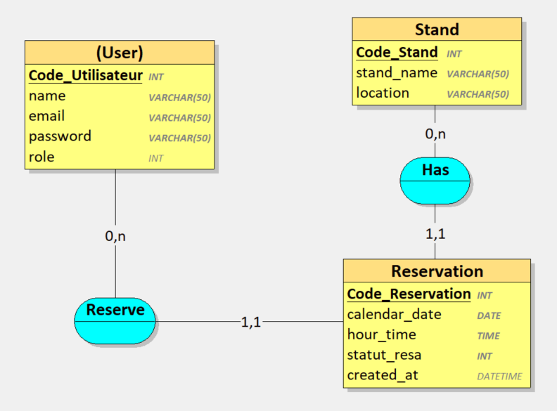

# Résumé

Le but de ce projet est simplement de faciliter l’organisation et la gestion de stands, sur un marché, par exemple. Typiquement, Un utilisateur doit voir au premier coup d'œil quelles sont les personnes qui tiennent le stand, à quelle(s) date(s), quel(s) créneau(x) horaire(s) et où.
L’utilisateur lambda doit pouvoir se connecter pour voir l’affichage. L’administrateur et les modérateurs peuvent ajouter-modifier-supprimer des informations.

L’idée est aussi de permettre à un utilisateur lambda d'envoyer une notification à l'admin et aux modérateurs pour s'inscrire sur un créneau....
Cet utilisateur voit un créneau de libre. Il pourrait cliquer dessus, soumettre un formulaire "Demande de réservation" => "Avec quelqu’un" ou "En attente" (comme ils doivent être deux).
L'admin reçoit une notification, et accepte ou non l'inscription et renvoie la réponse à l'utilisateur.

# Cahier des charges:

- ### Authentification et autorisation :

Les utilisateurs lambda doivent se connecter pour voir l'affichage, réserver un ou plusieurs créneau(x) ou s'y désister.
L'administrateur et les modérateurs ont les privilèges pour ajouter, modifier et supprimer des informations.

- ### Affichage des stands :

Afficher les informations sur les stands, y compris les personnes, les dates et les créneaux horaires.

- ### Réservation de créneaux :

Les utilisateurs lambda peuvent soumettre des demandes de réservation pour les créneaux libres.
Les demandes peuvent être soumises avec un partenaire spécifique ou en attente d'un partenaire.
Les administrateurs reçoivent des notifications pour approuver la réservation ou signaler que le créneau est déjà pris.

## Routes front:

| Ressource    | Route                   | Méthode | Code de Retour               | Contrôleur           |
| ------------ | ----------------------- | ------- | ---------------------------- | -------------------- |
| Affichage    |                         |         |                              |                      |
|              | `/stands`               | GET     | 200 OK, 404 Not Found        | `FrontendController` |
|              | `/stands/{id}`          | GET     | 200 OK, 404 Not Found        | `FrontendController` |
| Planning     |                         |         |                              |                      |
|              | `/schedule`             | GET     | 200 OK, 404 Not Found        | `FrontendController` |
|              | `/schedule/{date}`      | GET     | 200 OK, 404 Not Found        | `FrontendController` |
| Réservations |                         |         |                              |                      |
|              | `/reservations`         | GET     | 200 OK, 404 Not Found        | `FrontendController` |
|              | `/reservations/request` | POST    | 201 Created, 400 Bad Request | `FrontendController` |

## Routes Backoffice :

| Ressource         | Route                           | Méthode | Code de Retour                | Contrôleur              |
| ----------------- | ------------------------------- | ------- | ----------------------------- | ----------------------- |
| Authentification  |                                 |         |                               |                         |
|                   | `/backoffice/login`             | POST    | 200 OK, 401 Unauthorized      | `AuthController`        |
| Stands            |                                 |         |                               |                         |
|                   | `/backoffice/stands`            | GET     | 200 OK, 404 Not Found         | `StandController`       |
|                   | `/backoffice/stands`            | POST    | 201 Created, 400 Bad Request  | `StandController`       |
|                   | `/backoffice/stands/{id}`       | GET     | 200 OK, 404 Not Found         | `StandController`       |
|                   | `/backoffice/stands/{id}`       | PUT     | 200 OK, 404 Not Found         | `StandController`       |
|                   | `/backoffice/stands/{id}`       | DELETE  | 204 No Content, 404 Not Found | `StandController`       |
| Créneaux horaires |                                 |         |                               |                         |
|                   | `/backoffice/schedule`          | GET     | 200 OK, 404 Not Found         | `ScheduleController`    |
|                   | `/backoffice/schedule`          | POST    | 201 Created, 400 Bad Request  | `ScheduleController`    |
|                   | `/backoffice/schedule/{date}`   | GET     | 200 OK, 404 Not Found         | `ScheduleController`    |
|                   | `/backoffice/schedule/{id}`     | PUT     | 200 OK, 404 Not Found         | `ScheduleController`    |
|                   | `/backoffice/schedule/{id}`     | DELETE  | 204 No Content, 404 Not Found | `ScheduleController`    |
| Utilisateurs      |                                 |         |                               |                         |
|                   | `/backoffice/users`             | GET     | 200 OK, 404 Not Found         | `UserController`        |
|                   | `/backoffice/users`             | POST    | 201 Created, 400 Bad Request  | `UserController`        |
|                   | `/backoffice/users/{id}`        | GET     | 200 OK, 404 Not Found         | `UserController`        |
|                   | `/backoffice/users/{id}`        | PUT     | 200 OK, 404 Not Found         | `UserController`        |
|                   | `/backoffice/users/{id}`        | DELETE  | 204 No Content, 404 Not Found | `UserController`        |
| Réservations      |                                 |         |                               |                         |
|                   | `/backoffice/reservations`      | GET     | 200 OK, 404 Not Found         | `ReservationController` |
|                   | `/backoffice/reservations`      | POST    | 201 Created, 400 Bad Request  | `ReservationController` |
|                   | `/backoffice/reservations/{id}` | GET     | 200 OK, 404 Not Found         | `ReservationController` |
|                   | `/backoffice/reservations/{id}` | PUT     | 200 OK, 404 Not Found         | `ReservationController` |
|                   | `/backoffice/reservations/{id}` | DELETE  | 204 No Content, 404 Not Found | `ReservationController` |
| Lieux             |                                 |         |                               |                         |
|                   | `/backoffice/locations`         | GET     | 200 OK, 404 Not Found         | `LocationController`    |
|                   | `/backoffice/locations`         | POST    | 201 Created, 400 Bad Request  | `LocationController`    |
|                   | `/backoffice/locations/{id}`    | GET     | 200 OK, 404 Not Found         | `LocationController`    |
|                   | `/backoffice/locations/{id}`    | PUT     | 200 OK, 404 Not Found         | `LocationController`    |
|                   | `/backoffice/locations/{id}`    | DELETE  | 204 No Content, 404 Not Found | `LocationController`    |

## Routes API (REST) :

| Ressource         | Route                             | Méthode | Code de Retour                         | Contrôleur              |
| ----------------- | --------------------------------- | ------- | -------------------------------------- | ----------------------- |
| Authentification  |                                   |         |                                        |                         |
|                   | `/api/login`                      | POST    | 200 OK, 401 Unauthorized               | `AuthController`        |
| Stands            |                                   |         |                                        |                         |
|                   | `/api/stands`                     | GET     | 200 OK, 404 Not Found                  | `StandController`       |
|                   | `/api/stands`                     | POST    | 201 Created, 400 Bad Request           | `StandController`       |
|                   | `/api/stands/{id}`                | GET     | 200 OK, 404 Not Found                  | `StandController`       |
|                   | `/api/stands/{id}`                | PUT     | 200 OK, 404 Not Found                  | `StandController`       |
|                   | `/api/stands/{id}`                | DELETE  | 204 No Content, 404 Not Found          | `StandController`       |
| Créneaux horaires |                                   |         |                                        |                         |
|                   | `/api/schedule`                   | GET     | 200 OK, 404 Not Found                  | `ScheduleController`    |
|                   | `/api/schedule`                   | POST    | 201 Created, 400 Bad Request           | `ScheduleController`    |
|                   | `/api/schedule/{date}`            | GET     | 200 OK, 404 Not Found                  | `ScheduleController`    |
|                   | `/api/schedule/{id}`              | PUT     | 200 OK, 404 Not Found                  | `ScheduleController`    |
|                   | `/api/schedule/{id}`              | DELETE  | 204 No Content, 404 Not Found          | `ScheduleController`    |
| Utilisateurs      |                                   |         |                                        |                         |
|                   | `/api/users`                      | GET     | 200 OK, 404 Not Found                  | `UserController`        |
|                   | `/api/users`                      | POST    | 201 Created, 400 Bad Request           | `UserController`        |
|                   | `/api/users/{id}`                 | GET     | 200 OK, 404 Not Found                  | `UserController`        |
|                   | `/api/users/{id}`                 | PUT     | 200 OK, 404 Not Found                  | `UserController`        |
|                   | `/api/users/{id}`                 | DELETE  | 204 No Content, 404 Not Found          | `UserController`        |
| Réservations      |                                   |         |                                        |                         |
|                   | `/api/reservations`               | GET     | 200 OK, 404 Not Found                  | `ReservationController` |
|                   | `/api/reservations`               | POST    | 201 Created, 400 Bad Request           | `ReservationController` |
|                   | `/api/reservations/{id}`          | GET     | 200 OK, 404 Not Found                  | `ReservationController` |
|                   | `/api/reservations/request`       | POST    | 201 Created, 400 Bad Request           | `ReservationController` |
|                   | `/api/reservations/{id}/approval` | PUT     | 200 OK, 404 Not Found, 400 Bad Request | `ReservationController` |
| Lieux             |                                   |         |                                        |                         |
|                   | `/api/locations`                  | GET     | 200 OK, 404 Not Found                  | `LocationController`    |
|                   | `/api/locations`                  | POST    | 201 Created, 400 Bad Request           | `LocationController`    |
|                   | `/api/locations/{id}`             | GET     | 200 OK, 404 Not Found                  | `LocationController`    |
|                   | `/api/locations/{id}`             | PUT     | 200 OK, 404 Not Found                  | `LocationController`    |
|                   | `/api/locations/{id}`             | DELETE  | 204 No Content, 404 Not Found          | `LocationController`    |

## UserStories

| ID   | En tant que        | Je veux pouvoir...                                  | Afin de...                                      |
| ---- | ------------------ | --------------------------------------------------- | ----------------------------------------------- |
| US1  | Utilisateur lambda | Voir la liste des stands sur un marché              | Savoir quelles personnes tiennent les stands    |
| US2  | Utilisateur lambda | Voir les détails d'un stand spécifique              | Connaître les personnes, dates et emplacements  |
| US3  | Utilisateur lambda | Voir le planning des créneaux horaires              | Identifier les créneaux disponibles             |
| US4  | Utilisateur lambda | Voir les créneaux disponibles pour une date donnée  | Planifier ma participation sur un créneau       |
| US5  | Utilisateur lambda | Voir la liste des réservations                      | Connaître les réservations en cours             |
| US6  | Utilisateur lambda | Envoyer une demande de réservation                  | M'inscrire sur un créneau spécifique            |
| US7  | Administrateur     | Ajouter, modifier ou supprimer des informations     | Gérer les stands, créneaux et réservations      |
| US8  | Modérateur         | Accepter ou refuser une réservation                 | Gérer les demandes d'inscription                |
| US9  | Utilisateur lambda | Voir les détails d'une réservation spécifique       | Connaître les détails d'une réservation         |
| US10 | Utilisateur lambda | Voir la liste des utilisateurs                      | Gérer les profils des utilisateurs              |
| US11 | Utilisateur lambda | Voir les détails d'un utilisateur spécifique        | Connaître les informations d'un utilisateur     |
| US12 | Administrateur     | Ajouter, modifier ou supprimer des utilisateurs     | Gérer les utilisateurs                          |
| US13 | Utilisateur lambda | Voir les détails d'une réservation spécifique       | Connaître les détails d'une réservation         |
| US14 | Administrateur     | Voir la liste des lieux                             | Gérer les emplacements des stands               |
| US15 | Administrateur     | Ajouter, modifier ou supprimer des lieux            | Gérer les emplacements des stands               |
| US16 | Utilisateur lambda | Se connecter avec des informations d'identification | Accéder aux fonctionnalités de l'administration |

## MCD :

