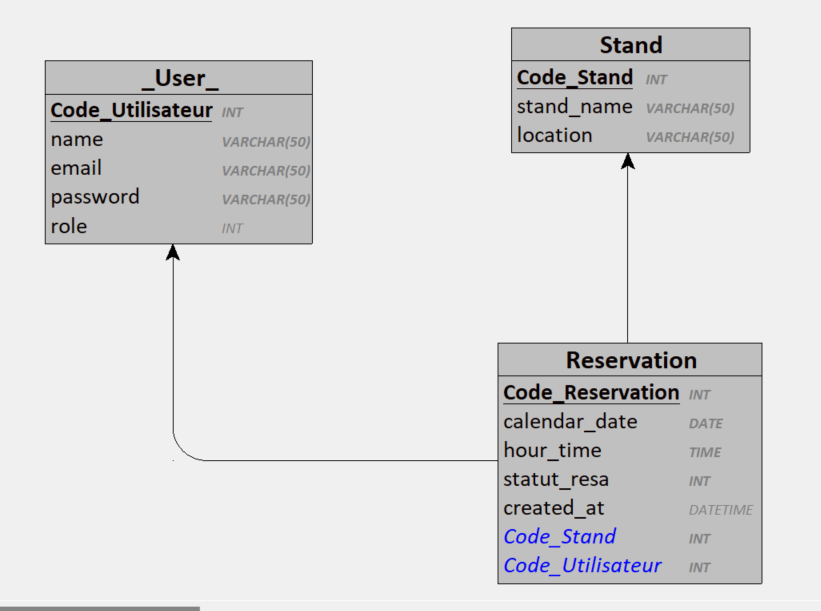

# Résumé

Le but de ce projet est simplement de faciliter l’organisation et la gestion de stands, sur un marché, par exemple.
L’utilisateur lambda doit pouvoir se connecter pour voir l’affichage. L’administrateur et les modérateurs peuvent ajouter-modifier-supprimer des informations. Ce sont eux qui ajoutent les données et crééent les comptes.

<!-- L’idée est aussi de permettre à un utilisateur lambda d'envoyer une notification à l'admin et aux modérateurs pour s'inscrire sur un créneau....
Cet utilisateur voit un créneau de libre. Il pourrait cliquer dessus, soumettre un formulaire "Demande de réservation" => "Avec quelqu’un" ou "En attente" (comme ils doivent être deux).
L'admin reçoit une notification, et accepte ou non l'inscription et renvoie la réponse à l'utilisateur. -->

# Cahier des charges:

- ### Authentification et autorisation :

Les utilisateurs lambda doivent se connecter pour voir l'affichage, réserver un ou plusieurs créneau(x) ou s'y désister.
L'administrateur et les modérateurs ont les privilèges pour ajouter, modifier et supprimer des informations.

- ### Affichage des stands :

Afficher les informations sur les stands, y compris les personnes, les dates et les créneaux horaires.

- ### Réservation de créneaux :

Les utilisateurs lambda peuvent soumettre des demandes de réservation pour les créneaux libres.
Les demandes peuvent être soumises avec un partenaire spécifique ou en attente d'un partenaire.
Les administrateurs reçoivent des notifications pour approuver la réservation ou signaler que le créneau est déjà pris.

## Routes Backoffice :

| Ressource        | Route                    | Méthode | Code de Retour                | Contrôleur              |
| ---------------- | ------------------------ | ------- | ----------------------------- | ----------------------- |
| Authentification |                          |         |                               |                         |
|                  | `/login`                 | POST    | 200 OK, 401 Unauthorized      | `SecurityController`    |
| Stands           |                          |         |                               |                         |
|                  | `/stand`                 | GET     | 200 OK, 404 Not Found         | `StandController`       |
|                  | `/stand/new`             | POST    | 201 Created, 400 Bad Request  | `StandController`       |
|                  | `/stand/{id}`            | GET     | 200 OK, 404 Not Found         | `StandController`       |
|                  | `/stand/{id}/edit`       | PUT     | 200 OK, 404 Not Found         | `StandController`       |
|                  | `/stand/{id}`            | DELETE  | 204 No Content, 404 Not Found | `StandController`       |
| Utilisateurs     |                          |         |                               |                         |
|                  | `/user`                  | GET     | 200 OK, 404 Not Found         | `UserController`        |
|                  | `/user/new`              | POST    | 201 Created, 400 Bad Request  | `UserController`        |
|                  | `/user/{id}`             | GET     | 200 OK, 404 Not Found         | `UserController`        |
|                  | `/user/{id}/edit`        | PUT     | 200 OK, 404 Not Found         | `UserController`        |
|                  | `/user/{id}`             | DELETE  | 204 No Content, 404 Not Found | `UserController`        |
| Réservations     |                          |         |                               |                         |
|                  | `/reservation`           | GET     | 200 OK, 404 Not Found         | `ReservationController` |
|                  | `/reservation/new`       | POST    | 201 Created, 400 Bad Request  | `ReservationController` |
|                  | `/reservation/{id}`      | GET     | 200 OK, 404 Not Found         | `ReservationController` |
|                  | `/reservation/{id}/edit` | PUT     | 200 OK, 404 Not Found         | `ReservationController` |
|                  | `/reservation/{id}`      | DELETE  | 204 No Content, 404 Not Found | `ReservationController` |

## Routes API (REST) :

| Ressource    | Route                   | Méthode | Code de Retour        | Contrôleur                 |
| ------------ | ----------------------- | ------- | --------------------- | -------------------------- |
| Stands       |                         |         |                       |                            |
|              | `/api/stand`            | GET     | 200 OK, 404 Not Found | `ApiStandController`       |
|              | `/api/stand`            | POST    | 200 OK, 404 Not Found | `ApiStandController`       |
|              | `/api/stand/{id}`       | GET     | 200 OK, 404 Not Found | `ApiStandController`       |
|              | `/api/stand/{id}`       | PUT     | 200 OK, 404 Not Found | `ApiStandController`       |
| Utilisateurs |                         |         |                       |                            |
|              | `/api/user`             | GET     | 200 OK, 404 Not Found | `ApiUserController`        |
|              | `/api/user`             | POST    | 200 OK, 404 Not Found | `ApiUserController`        |
|              | `/api/user/{id}`        | GET     | 200 OK, 404 Not Found | `ApiUserController`        |
|              | `/api/user/{id}`        | PUT     | 200 OK, 404 Not Found | `ApiUserController`        |
| Réservations |                         |         |                       |                            |
|              | `/api/reservation`      | GET     | 200 OK, 404 Not Found | `ApiReservationController` |
|              | `/api/reservation`      | POST    | 200 OK, 404 Not Found | `ApiReservationController` |
|              | `/api/reservation/{id}` | GET     | 200 OK, 404 Not Found | `ApiReservationController` |
|              | `/api/reservation/{id}` | PUT     | 200 OK, 404 Not Found | `ApiReservationController` |

## UserStories

| En tant que                 | Je veux pouvoir...                                  | Afin de...                                        |
| --------------------------- | --------------------------------------------------- | ------------------------------------------------- |
| Utilisateur lambda          | Voir la liste des stands reservés                   | Savoir quand et où je suis prévu                  |
| Utilisateur lambda          | Se connecter avec des informations d'identification | Accéder à son dashboard personnel                 |
| Administrateur / Modérateur | Ajouter, modifier ou supprimer des informations     | Gérer les stands, lieux, créneaux et réservations |
| Administrateur / Modérateur | Voir la liste des utilisateurs                      | Gérer les utilisateurs                            |
| Administrateur / Modérateur | Ajouter, modifier ou supprimer des utilisateurs     | Gérer les utilisateurs                            |
| Administrateur / Modérateur | Voir la liste des stands                            | Gérer les emplacements des stands                 |
| Administrateur / Modérateur | Ajouter, modifier ou supprimer des stands           | Gérer les emplacements des stands                 |
| Administrateur / Modérateur | Voir la liste des reservations                      | Gérer les reservations des stands                 |
| Administrateur / Modérateur | Ajouter, modifier ou supprimer des reservations     | Gérer les reservations des stands                 |

## MCD :

## MPD :

